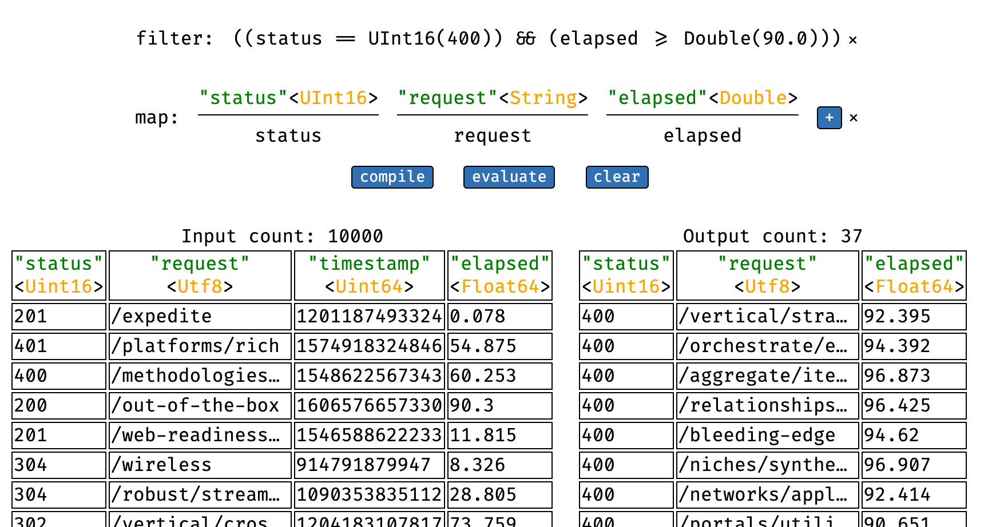

# Apache Gandiva for WebAssembly


This project brings [Apache Gandiva](https://arrow.apache.org/blog/2018/12/05/gandiva-donation/) to [WebAssembly](https://webassembly.org/). Gandiva is a LLVM-based expression compiler and a high-performance execution environment for data processing on [Apache Arrow](https://arrow.apache.org/) buffers.

It allows building complex _filter_ and _map_ expressions, and just-in-time compilation to machine code (or, in our case, WebAssembly). The resulting expressions can be executed very efficiently, since the compiled code has minimal runtime overhead and maximizes the use of fast CPU caches.

Gandiva for WebAssembly is built using [Emscripten](https://emscripten.org/). It depends on the upstream LLVM project, and contains minor modifications to Gandiva to make it operational in WebAssembly. Specifically, the project contains [fixes](https://github.com/apache/arrow/pull/10772) for platform-agnostic handling of pointers in generated code and adjustments to accomplish dynamic linking on WebAssembly. It works by instantiating WebAssembly modules on the host system and links modules via function imports and an indirect function table.

# Demo

This project contains a small demo, allowing you to build and execute expression trees in your browser:



<a href="https://pablosichert.github.io/gandiva-wasm">
    <p align="center">
        Launch Gandiva demo in your browser
    </p>
</a>

Currently, only browsers which implement [exception handling in WebAssembly](https://github.com/WebAssembly/exception-handling) are supported.

# API

To interact with Gandiva from JavaScript, have a look at the list of functions available in our [host bindings](https://github.com/pablosichert/arrow/blob/gandiva-wasm/cpp/src/gandiva/wasm_bindings.cc#L438-L526).

# Development

Build the development container which includes all dependencies necessary for building:

```
docker build - < Dockerfile
```

Build Gandiva's OpenSSL dependency for WebAssembly:

```
$ ./scripts/build_openssl.sh [debug|release]
```

Build Gandiva's LLVM dependency for WebAssembly:

```
$ ./scripts/build_llvm.sh [debug|release]
```

Build Gandiva for WebAssembly:

```
$ ./scripts/build.sh [debug|release]
```

Bundle Gandiva as a JavaScript module:

```
$ npm run build:[debug|release]
```

Run tests:

```
$ npm run test:node
```

Run benchmarks:

```
$ npm run benchmark:[browser|node]
```
